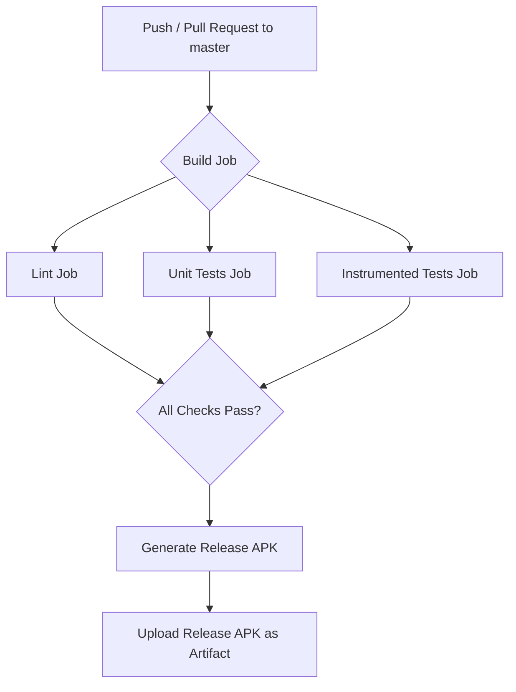

# Plan: `github-debug-pipeline`

## 1. Summary

This plan outlines the creation of a "bulletproof" debugging pipeline using GitHub Actions for the `rikkahub` project. The pipeline will analyze code quality, run comprehensive tests, and produce a standard production-ready release APK. It will incorporate findings from static analysis, linting, unit tests, instrumented tests, and address identified architectural and security concerns.

## 2. Scope

### In Scope
- Creation of a new GitHub Actions workflow file: `.github/workflows/debug-pipeline.yml`.
- Integration of code quality checks (Android Lint, web-ui ESLint).
- Execution of unit tests (Kotlin JVM, web-ui Vitest).
- Execution of instrumented tests (Android).
- Generation of a standard production-ready release APK.
- Addressing the critical security vulnerability (plaintext sensitive data) as a primary goal for future implementation.
- Addressing architectural/maintainability issues as secondary goals for future implementation.
- Setup of build caching for Gradle and pnpm.
- Test result reporting and coverage tracking (Codecov for Kotlin, Vitest for web-ui).

### Out of Scope
- Implementing the actual code fixes for identified "badly executed code" (e.g., encryption of sensitive data, refactoring `ProviderManager`). This plan only focuses on establishing the pipeline to *identify* these issues.
- Deep performance profiling beyond integrating existing Gradle performance-related tasks.
- Setting up device farms or advanced cloud testing platforms.
- End-to-end user flow testing across mobile and web.
- Formal cross-service contract testing.

## 3. Architecture

The debugging pipeline will be a multi-job GitHub Actions workflow:

**Workflow structure (`.github/workflows/debug-pipeline.yml`):**
- **Trigger:** `on: [push, pull_request]` to `master`.
- **Jobs:**
    - `build`: Responsible for checking out code, setting up environment (Java, Node.js, pnpm), caching dependencies, building `web-ui`, creating `google-services.json` placeholder, and running `assembleDebug`.
    - `lint`: Depends on `build`. Runs Android Lint and web-ui ESLint.
    - `unit_tests`: Depends on `build`. Runs Kotlin JVM unit tests and web-ui Vitest unit tests. Publishes results and coverage.
    - `instrumented_tests`: Depends on `build`. Sets up an Android emulator and runs `connectedDebugAndroidTest`. Publishes results.
    - (Implicit final step): All jobs must pass for the workflow to succeed, enforced by branch protection rules.

## 4. What to do

1.  **Repository Setup**: Ensure `https://github.com/kingkaonix/rikkahub.git` is the correct repository. (Already cloned).
2.  **Delete Existing CI/CD**: Remove any existing GitHub Actions workflows in `.github/workflows/` to ensure a clean slate, as requested.
3.  **Create Workflow File**: Create `.github/workflows/debug-pipeline.yml` with the structure defined above.
4.  **`build` Job**:
    - Checkout code (`actions/checkout@v4` with `submodules: true`).
    - Setup Java (`actions/setup-java@v4`, Java 17).
    - Setup Node.js (`actions/setup-node@v4`, Node 20).
    - Install pnpm globally.
    - Cache Gradle dependencies (`~/.gradle/caches`, `~/.gradle/wrapper`).
    - Cache pnpm dependencies (`~/.pnpm-store`).
    - Install `web-ui` pnpm dependencies.
    - Build `web-ui`.
    - Create `google-services.json` placeholder (from GitHub Secrets).
    - Run `./gradlew assembleDebug`.
5.  **`lint` Job**:
    - Checkout code, setup Java, Node.js, pnpm (similar to `build`).
    - Run `./gradlew lint` (Android).
    - Run `pnpm lint` in `web-ui` directory (ESLint).
    - Ensure both commands fail the job on errors (`continue-on-error: false`).
6.  **`unit_tests` Job**:
    - Checkout code, setup Java, Node.js, pnpm, cache dependencies.
    - Run `./gradlew test` (Kotlin JVM unit tests).
    - Run `pnpm test --run` in `web-ui` directory (Vitest unit tests).
    - Publish Kotlin test results using `dorny/test-reporter@v1` (JUnit XML from `**/build/test-results/testDebugUnitTest/*.xml`).
    - Publish web-ui test results using `dorny/test-reporter@v1` (JUnit XML from `web-ui/junit.xml`).
    - Generate Kotlin coverage report with `./gradlew jacocoTestReport`.
    - Upload Kotlin coverage to Codecov using `codecov/codecov-action@v4`.
    - Upload web-ui coverage report as artifact.
7.  **`instrumented_tests` Job**:
    - Checkout code, setup Java.
    - Install Android SDK (`malinskiy/action-android/install-sdk@master`).
    - Create AVD and start emulator (`malinskiy/action-android/emulator-run-cmd@master`, API 33).
    - Run `./gradlew connectedDebugAndroidTest`.
    - Publish results using `dorny/test-reporter@v1` (JUnit XML from `**/build/outputs/androidTest-results/connected/*.xml`).
8.  **Release APK Generation**: After all checks pass, build a release APK using `./gradlew assembleRelease`. This step will need to handle signing configuration (via GitHub Secrets for keystore and credentials).
9.  **Upload Release APK**: Upload the generated `app-release.apk` as a GitHub Action artifact.
10. **Branch Protection**: Recommend configuring GitHub branch protection rules to require all jobs (`build`, `lint`, `unit_tests`, `instrumented_tests`) to pass before merging to `master`.

## 5. What NOT to do

- Do not introduce new dependencies unless strictly necessary for the pipeline itself.
- Do not modify existing source code to fix the identified "badly executed code" in this planning phase. The goal is to set up the detection.
- Do not create separate workflows for each test type if a single comprehensive workflow can manage them effectively.
- Do not hardcode sensitive credentials directly in the workflow file. Always use GitHub Secrets.
- Do not override the user's `opencode.json` without explicit confirmation. (Already handled by installer).

## 6. Security considerations

- **Sensitive Data Storage**: The pipeline will detect (via lint/static analysis) but not fix the critical plaintext storage of API keys and other credentials in `PreferencesStore.kt`. The plan for fixing this is to implement encryption using `EncryptedSharedPreferences` or custom DataStore serializers. This is a high-priority manual fix.
- **`google-services.json`**: Use a placeholder from GitHub Secrets for CI builds to avoid committing sensitive Firebase configuration. Real Firebase credentials for instrumented tests should also be managed via secrets.
- **Signing Keystore**: The release APK signing keystore and its passwords *must* be stored securely as GitHub Secrets and never directly in the repository.
- **Permissions**: Grant GitHub Actions workflows only the minimum necessary permissions.

## 7. Performance considerations

- **Caching**: Implement Gradle and pnpm dependency caching to significantly speed up CI runs.
- **Parallel Jobs**: Run `lint`, `unit_tests`, `instrumented_tests` jobs in parallel where possible, after the initial `build` job, to reduce overall execution time.
- **Test Performance**: Unit tests should be fast; instrumented tests will inherently take longer due to emulator startup. Focus on optimizing test execution time where possible.
- **Artifact Uploads**: Only upload necessary artifacts (release APK, coverage reports) to minimize upload/download times.

## 8. DevOps and observability

- **CI/CD Platform**: GitHub Actions will be the primary CI/CD platform.
- **Workflow File**: `.github/workflows/debug-pipeline.yml`.
- **Environment**: `ubuntu-latest` runners.
- **Logs**: GitHub Actions provides detailed logs for each step.
- **Metrics/Reporting**: Test results will be reported directly in the GitHub Actions UI via `dorny/test-reporter`. Coverage will be tracked via Codecov integration for Kotlin and artifact upload for web-ui.
- **Artifacts**: Release APK, JUnit XML reports, and coverage reports will be uploaded as workflow artifacts.

## 9. Implementation tasks

1.  **Agent**: `@devops-engineer`
    **Task**: Remove any existing CI/CD workflows in `.github/workflows/`.
    **Verification**: `.github/workflows/` directory is empty or contains only the new workflow.
2.  **Agent**: `@devops-engineer`
    **Task**: Create `.github/workflows/debug-pipeline.yml` with the `build` job, including setup, caching, `web-ui` build, `google-services.json` placeholder, and `assembleDebug`.
    **Verification**: Workflow file exists and `build` job passes on a push.
3.  **Agent**: `@devops-engineer`
    **Task**: Add the `lint` job to `debug-pipeline.yml`, including Android lint and web-ui ESLint.
    **Verification**: `lint` job passes, failing on actual lint errors.
4.  **Agent**: `@devops-engineer`
    **Task**: Add the `unit_tests` job to `debug-pipeline.yml`, including Kotlin and web-ui unit tests, test result publishing, and coverage reporting setup.
    **Verification**: `unit_tests` job passes, reports are published, and coverage is uploaded.
5.  **Agent**: `@devops-engineer`
    **Task**: Add the `instrumented_tests` job to `debug-pipeline.yml`, including Android SDK setup, emulator launch, and `connectedDebugAndroidTest`.
    **Verification**: `instrumented_tests` job passes and reports are published.
6.  **Agent**: `@devops-engineer`
    **Task**: Add a step to generate the release APK using `./gradlew assembleRelease` and upload it as an artifact. This requires configuring GitHub Secrets for signing credentials (user intervention may be needed for secret creation).
    **Verification**: Release APK is generated and uploaded as an artifact.

## 10. Testing strategy

The pipeline itself is a testing mechanism, so its internal testing is crucial:

- **Unit Tests (Kotlin JVM & web-ui Vitest)**:
    - **Execution**: `./gradlew test` and `pnpm test --run`.
    - **Reporting**: `dorny/test-reporter` for JUnit XML.
    - **Coverage**: JaCoCo for Kotlin, Vitest for web-ui, integrated with Codecov.
- **Android Lint & web-ui ESLint**:
    - **Execution**: `./gradlew lint` and `pnpm lint`.
    - **Failure**: Jobs configured to fail if any lint errors are found.
- **Android Instrumented Tests**:
    - **Execution**: `./gradlew connectedDebugAndroidTest` on an emulated device.
    - **Reporting**: `dorny/test-reporter` for JUnit XML.
- **"Bulletproof" Aspects**:
    - **Failure Configuration**: All relevant steps and jobs set to `fail-on-error: true` or `continue-on-error: false` to ensure pipeline stops on first critical failure.
    - **Branch Protection**: Mandate all pipeline jobs pass for `master` branch merges.
    - **Reporting**: Clear, visible test reports in GitHub Actions UI.
    - **Artifacts**: Upload all test reports (raw XML) and coverage artifacts for deeper analysis if needed.

## 11. Migration path

- **Existing CI/CD**: The plan explicitly states to delete any existing CI/CD. This pipeline is a fresh start.
- **GitHub Secrets**: Users will need to manually configure GitHub Secrets for `GOOGLE_SERVICES_JSON_PLACEHOLDER`, `ANDROID_SIGNING_KEYSTORE_BASE64`, `ANDROID_SIGNING_KEYSTORE_PASSWORD`, `ANDROID_SIGNING_KEY_ALIAS`, `ANDROID_SIGNING_KEY_PASSWORD`. Guidance will be provided.

## 12. Rollout plan

1.  **Initial Commit**: Commit the `.github/workflows/debug-pipeline.yml` file to a feature branch.
2.  **Validation Run**: Create a pull request to `master` (or push directly to a test branch) to trigger the workflow and ensure all jobs execute correctly without errors.
3.  **Secret Configuration**: Guide the user to configure necessary GitHub Secrets.
4.  **Full Test**: Trigger another run after secrets are configured to verify release APK generation and signing.
5.  **Branch Protection**: Once the workflow is stable, configure branch protection rules for the `master` branch to require all checks to pass.
6.  **Monitoring**: Monitor initial runs for stability and performance.

## 13. Open questions

- For `performance-engineer` feedback: What are the specific performance requirements (response time, throughput, memory limits) for Rikkahub? Are there existing benchmarks or specific performance issues to target? (User input needed for these to further refine performance aspects of the pipeline or code analysis).
- Are there specific code quality tools beyond Android Lint and ESLint that should be integrated (e.g., ktlint for Kotlin, SonarQube)?
- Are there any specific security checks (e.g., SAST tools) beyond static analysis for sensitive data that should be included in the pipeline?
